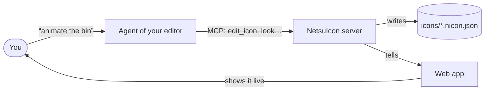
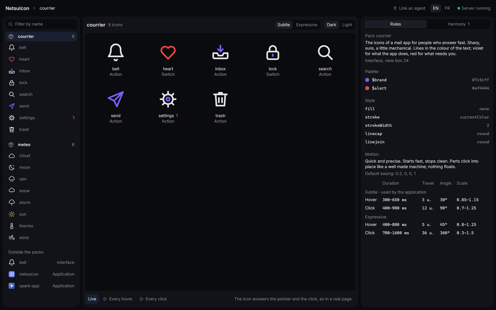
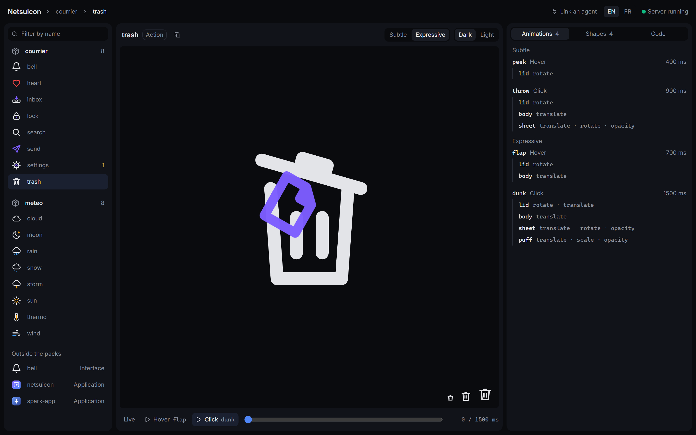

<div align="center">
  
  <h1>NetsuIcon</h1>
</div>

NetsuIcon is an editor of animated icons that you drive by talking to an agent. The agent of your code editor draws and animates the icon in small operations, through a local MCP server. A web app shows the icon change live, then hands you the code: an SVG animated with CSS, or a React component.



These sixteen icons are the examples of this repository, in `icons/`. The picture shows them playing their click by themselves; in a page, they answer the pointer.

> [!NOTE]
> First milestone, provisional name. The work so far went into small interface icons. Application icons work when you ask for one, but nothing has been tuned or tried for them yet: see [Where the project stands](#where-the-project-stands).

## How it works



An icon is one file, `<name>.nicon.json`: a tree of shapes, and animations called clips. The agent never rewrites the file. It sends a list of operations (`add_node`, `set_clip`, `set_track`…); all of them pass or none does, and a saved file can always be drawn and exported. To see what it did, the agent asks for a picture: the icon at rest, or the key moments of every clip side by side.

## Run it

You need Node and pnpm.

```bash
pnpm install
pnpm dev
```

The app is at `http://localhost:1440`. The server listens on `127.0.0.1:6210` and nowhere else: it refuses a request that comes from another origin.

## Link your agent

In this folder, Claude Code reads `.mcp.json` and offers the server. From another project:

```bash
claude mcp add --transport http netsuicon http://127.0.0.1:6210/mcp
```

Any agent that speaks MCP over HTTP can connect to the same address. Then ask, for instance:

- "make a bell icon that rings on hover";
- "make a pack for my weather app, calm, thin strokes, then the sun, rain and wind icons";
- "the `send` icon of the `courrier` pack: make the plane really take off on click".

## The app



On the left, the packs and their icons, with a field that filters by name. In the middle, the sheet of a pack: all its icons side by side, alive, with two buttons that replay every hover or every click. On the right, the rules of the pack and, in the Harmony tab, the icons that depart from them.



An open icon answers the pointer and the click as it would in a real page. You can also replay one clip, move through it by hand, change the background, and see the icon at its real sizes. The panel on the right lists its animations and its shapes, and gives the code to copy. Every icon has its own address (`#/courrier/trash`), and a button copies its reference to paste to the agent.

The app speaks English and French. It starts in English; a switch in the header changes it, and the agent sets it to the language you write to it in.

## What an icon can do

### Two reactions



On hover, the icon hints at what it does: the lid lifts a little. On click, it does it: the lid opens, a sheet of paper falls in, the lid shuts. The sheet is a prop: unseen at rest, there only during the click. A prop is an object anyone can name, never a dot.

### Three types



What a click does depends on what the icon stands for.

- An **action** is done and over: delete, send, receive. The icon comes back to rest.
- A **switch** keeps its state: the padlock stays open, the heart stays full. The next click undoes it.
- A **state** lasts with no press at all: a loader spins.

### Two manners



An icon can carry two sets of animations. The **subtle** manner is one idea, small and short, for an interface people work in. The **expressive** manner plays the same idea as a short scene: the wind-up, the act, what it leaves behind. The pack says which one the application uses, and an export writes one of them.

### Packs

A pack holds the icons of one application: a folder `icons/<pack>/` with a `pack.json`. It sets what they share.

- The **style**: stroke width, round or square ends.
- The **palette**: named colours, which icons write as `$name`.
- The **motion**: its character in one sentence, the default easing, and how far each reaction may go, in each manner.

Icons copy none of it. Change a colour or the stroke width in the pack and every icon changes at once. An icon that departs from its pack is reported to the agent and in the app. That is advice, not an error: it may depart on purpose.

There are also two modes. The interface mode draws with strokes in a view box of 24: everything above is in that mode. The application mode draws with fills and gradients in a view box of 1024; the icon at the top of this page is made that way.

## The exported code

- **Animated SVG**: one file, CSS `@keyframes`, no script. The hover works by itself. For the click, the page sets an attribute on the `<svg>`: `data-play` plays an action whole, `data-state="on"` then `"off"` holds a switch.
- **React**: a component on `motion/react`, which handles the hover, the click and the state itself.
- **Still SVG**: the icon at rest.
- **Page of a pack**: one self-contained HTML file where every icon answers the pointer and the click, to show a pack to someone.

The colours and the style of the pack are written into the code: it no longer depends on the pack. When the reader's system asks for less motion, the SVG stops moving and a switch still goes from one state to the other.

## The agent's tools

The server exposes thirteen MCP tools. The first, `guide`, gives the agent the format and the advice; it is all the agent knows, and it reads it once.

- Read: `list_icons`, `get_icon`, `get_pack`.
- See: `look` renders an icon as a PNG, at rest or at several moments of a clip; `look_pack` shows a whole pack in one picture.
- Write: `create_icon`, `edit_icon`, `create_pack`, `edit_pack`.
- Take away: `export_icon`, `export_pack`.
- `set_language` sets the language of the app.

Without an MCP connection, the same tools can be called from a terminal:

```bash
pnpm --filter @netsuicon/server mcp look_pack '{"pack":"meteo"}' meteo.png
```

## The animation skill

The server's guide gives the format. The method for animating is apart, in a skill: [`skills/netsu-icon-motion`](skills/netsu-icon-motion). Before touching the icon, the agent writes eight lines about the thing it draws: its parts, where the moving part is held, what drives it (a hand, gravity, a spring, a motor, wind), what it is made of. The movement follows. A plastic lid lifted by a hand does not start like a steel padlock let go by a spring.

To use it, give that folder to your agent like any other skill; with Claude Code, copy it into the `.claude/skills/` folder of your project.

## Where the project stands

- [x] **Interface icons**: drawing, two reactions, three types, two manners. Sixteen example icons, animated and then reviewed by agents that had only the skill and the tools.
- [x] **Packs**: shared style, palette and motion; departures reported.
- [x] **Exports**: animated SVG, React component, still SVG, page of a pack. The React component is tested, but has not yet been mounted in a real project.
- [x] **Animation skill**, for interface icons.
- [ ] **Application icons.** The agent can draw one and animate it when asked; the icon of this project is made that way. But neither the guide nor the skill has been worked on for them, and no trial has been run. No export to `.ico`, `.icns` or PNG.
- [ ] **Drawing by hand** in the app, or talking to the agent there: for now everything is done from the code editor.
- [ ] Lottie export, morphing one path into another.

Two things to know before you use it. There is no GIF, on purpose: an interface icon is a vector, and the preview is exactly the exported file. And the example icons were animated by agents, which judge a movement on still frames: rhythm is tuned by watching, so expect to retouch.

What is verified and what is not is kept in [`docs/STATUS.md`](docs/STATUS.md).

## Development

```bash
pnpm check   # types everywhere, and the same labels in every language
pnpm test    # vitest: the core and the MCP tools
pnpm --filter @netsuicon/server readme   # writes the animated pictures of this page again
```

The repository has three packages: `core` (the document, the operations, the exports; pure TypeScript that runs in the browser as well as in the server), `server` (the MCP server and the folder of icons) and `app` (the web app). The rules for working in it, for a person or for an agent, are in [`AGENTS.md`](AGENTS.md).

## Contributing

Read [`CONTRIBUTING.md`](CONTRIBUTING.md) first. Security reports go through [`SECURITY.md`](SECURITY.md), never a public issue.

## License

MIT. See [`LICENSE`](LICENSE).
